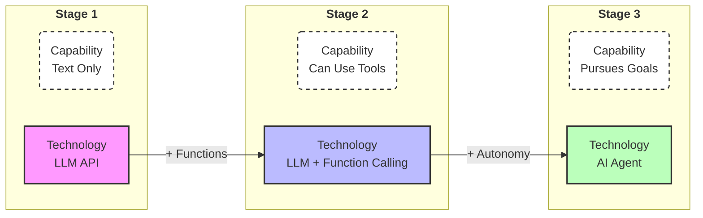
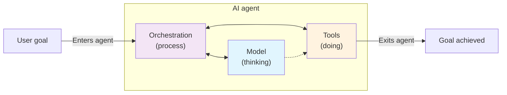
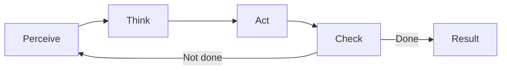

# Agent Fundamentals

## Before Agents

LLM APIs were a revolution, they allowed us to create applications that could understand and generate human-like text. However, they were limited to text-in, text-out. If you ask an LLM to plan a trip or manage your calendar, it will give you a advise, provide you detailed steps, but you still had to do all the work yourself.

There was a gap between knowledge and action, until function calling came, which allowed LLMs to interact with external systems by calling user-defined functions. However, the catch was that you had to define, orchestrate and manage all the function calls yourself. The model became a better assistant but you still had to do all the work and logic behind it.

Here's a real-life example of what was it like before agents.
Imagine asking an LLM to book a trip to Lisbon this summer:
- **LLM**: "Here's how to book a trip to Lisbon..."
- **LLM + Function Calling**: "I can search for flights if you tell me the exact dates, then I can search for hotels if you tell me the area..."
- **Agent**: "I found three flight options that work with your calendar and matched them with nearby hotels in your budget. I can book them for you if you confirm."

This is the value proposal of agents.

 

## So what is an AI Agent?

An agent isn't just an LLM with tools, it's a system that can reason, plan, and act to achieve a goal. According to Google's agent whitepaper, every agent is built from these 3 components:

1. **Model (thinking)** - The brain of the agent, responsible for reasoning, planning, and decision-making.
2. **Tools (doing)** - The agent's ability to interact with the external world through tools.
3. **Orchestration (process of connecting them)** - The logic that controls the flow of information between the model and the tools.

Instead of responding to each isolated request, an agent maintains context, plans ahead, and takes initiative to achieve objectives.

However, not everything that contains these components is an agent. Breaking down its definition, agents can be characterized by the following 5 properties:

* **Goal-Oriented** - Works towards objectives, not just respond to queries, understanding the difference between current state and desired state.

* **Autonomous Operation** - Can operate without constant human intervention, making decisions and taking actions on its own.

* **Proactive Initiative** - Actively works toward desired state even in absence of explicit instruction sets, it can reason about what it should do next.

4. **Environmental Awareness** - Agents observe and percieve their environment through various inputs like user requests, API responses, database states, etc. They build a model of the environment and use it to make decisions.

5. **Tool Use** - Agents can use tools to interact with their environment, such as calling APIs, running code, or accessing databases. This allows them to overcome the limitations of their training data and access real-time information.

## Deep dive on the 3 components

### Component 1: Model (the brain)

Responsible for reasoning, planning, and decision-making. It must:

- Understand the user's intent: extract the goal while handling with ambiguity.
- Make decisions: at each step, decides what to do next, requiring reasoning about priorities, dependencies, and possible outcomes.
- Learning from feedback: adapt its behavior based on past successes and failures.

### Component 2: Tools (the hands)

Without tools, even the smartest model in the world is just generating text about what it would do. Here are the three common types of tools:

- Pre-build integrations: handle common tasks by connecting to external services, such as Google Search, Google Calendar, etc.
- Custom functions: user-defined functions that allow agents to follow specific instructions or access internal systems.
- RAG tools: let agent access knowledge beyond its training data.

### Component 3: Orchestration (the process)

The orchestration layer its a cyclical process that governs how the agent takes an input, performs reasoning, and uses that reasoning to to inform its next action or decision. It implements the **Agent Loop** logic:

So when asked "book a trip to Lisbon next summer" it would:

- **Perceive** understand the request and current state (no flights booked, no hotel, travel dates unclear)
- **Think** reasons about what to do next (needs dates first, should check user's calendar for availability).
- **Act** agent uses calendar to find free periods during summer.
- **Check** checks if it reached desired state (trip booked). If not, it would repeat the process.

This loop would continue until the agent reaches the desired state (trip booked) or until it reaches a maximum number of iterations.

There are different reasoning frameworks like ReAct (reasoning + action), Chain of Thought, Tree of Thoughts, etc... but their core pattern is the same: Perceive, Think, Act, Check.
