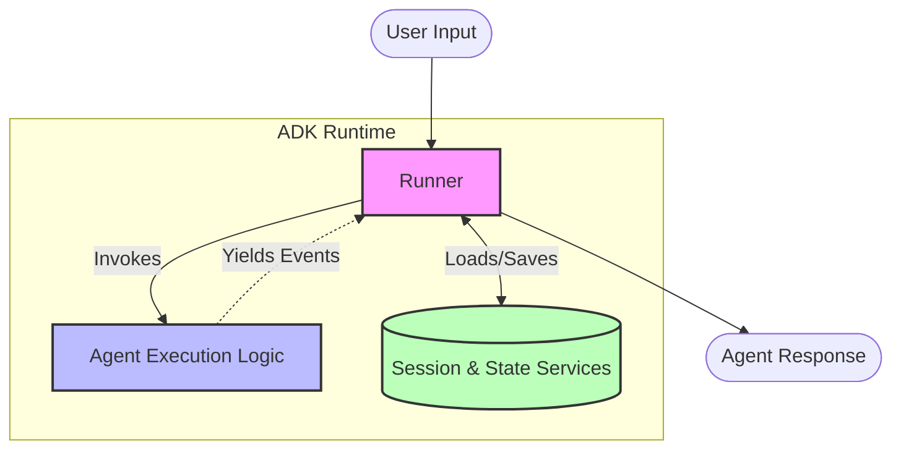
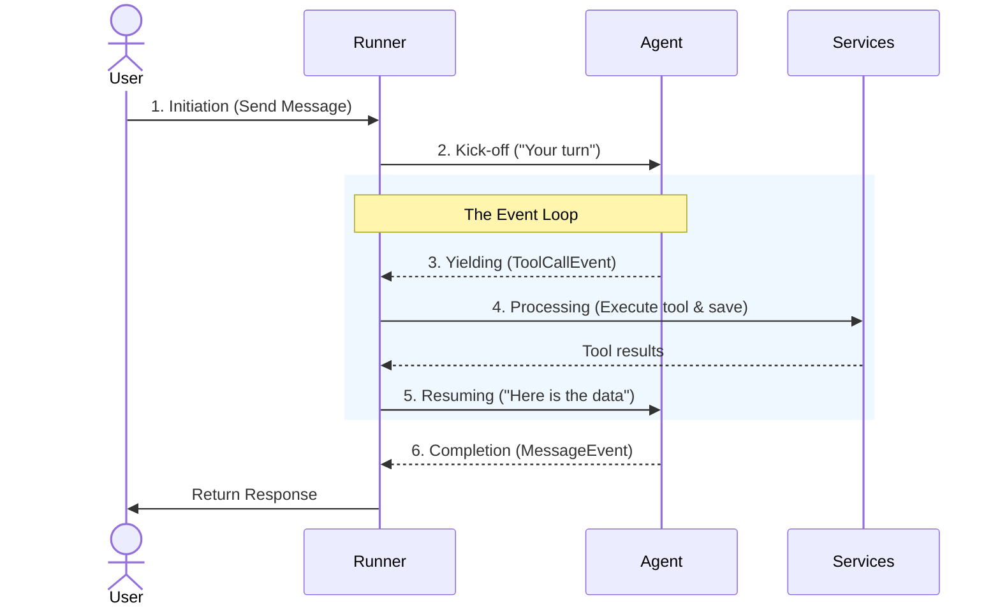

# Agent Development Kit (ADK)

## What is ADK?

Agent Development Kit (ADK) is an open-source framework by Google designed to build, deploy, evaluate, and manage AI agents. It applies software engineering rigor to agent development.

ADK stands out from other AI frameworks because it is:
- **Code-first but high-level:** You write Python, but session management, tool dispatching, and state persistence are handled for you.
- **Model Agnostic:** While optimized for Gemini, it supports models from any provider (OpenAI, Anthropic, Mistral) via Vertex AI Model Garden or `LiteLLM`.
- **Deployment Agnostic:** Agents can be run locally, bundled in Docker, or pushed to Cloud Run and Vertex AI Agent Engine with a single command.
- **Interoperable:** Via the Model Context Protocol (MCP) and Agent-to-Agent (A2A) protocol, ADK agents can consume any MCP server and talk to agents written in other frameworks (like LangGraph).

## ADK Agent as a System

- **Brain** (Model) - "thinking" part of your application
  * Objective: Pick the next best step to reach the goal.
  * Explanation: Understands what you asked, thinks through options, and decides whether to answer, ask, or use a tool.

- **Memory** (Context) - recall the conversation history
  * Objective: Remember useful details to make better choices.
  * Explanation: Keeps short-term chat context and, if enabled, long-term preferences so the agent stays consistent.

- **Tools** (Capabilities) - interact with external systems
  * Objective: Do real actions outside the model.
  * Explanation: Search the web, call APIs, run code, or handle files—then return results the brain can use.

- **Instructions** (Behavior)
  * Objective: Keep the agent aligned with your goal and rules.
  * Explanation: Sets role, tone, constraints, and examples so outputs match what you want.

- **Workflows** (Process) - deterministic and predictable execution patterns
  * Objective: Arrange steps for reliability and speed.
  * Explanation: Run tasks in order, in parallel, or in a loop to refine, and route to the right path when needed.

- **Callbacks** (Supervision) - checkpoints during the agent's process
  * Objective: Watch what’s happening and enforce guardrails.
  * Explanation: Before/after hooks to log, check inputs/outputs, apply policies, and handle errors without changing core logic.

## Core Architecture

You know the pieces (Model, Memory, Tools), but how do they actually talk to each other? How does the agent know when to stop thinking and start doing?

This coordination is handled by ADK's **Runtime**, which revolves around two main concepts: the **Runner** and the **Event Loop**.

### The Runner (Conductor)
Think of the Runner as an orchestra conductor. The LLM might know what notes to play, but the Runner dictates the tempo and manages the sheet music. When you ask your agent a question, your message first goes to the Runner and only then to the Agent.

### The Event Loop (Conversation Turn)
Instead of running a single, massive, unbreakable block of code from start to finish, ADK operates on an **Event Loop**. Every time the Agent decides to do something (like use a tool, or answer), it pauses and hands an "event" back to the Runner.

Here is exactly what happens during a single user request:
1. **Initiation:** You send a message. The **Runner** receives it and loads your conversation history (Session).
2. **Kick-off:** The Runner passes the context to the Agent and says "Your turn."
3. **Yielding (Event):** The Agent thinks. If it decides it needs to search the web, it *pauses* its own execution and hands a `ToolCallEvent` back to the Runner.
4. **Processing (Services):** The Runner catches that event, actually executes the web search tool, and saves the result to the database.
5. **Resuming:** The Runner hands the search results *back* to the Agent and says "Here is the data, continue."
6. **Completion:** This loop repeats until the Agent yields a final `MessageEvent` (the answer), which the Runner passes back to you.

**Why do it this way?** By handing control back to the Runner at every step, ADK can easily save your progress, stream the output in real-time, or stop execution if something goes wrong, without the LLM getting stuck in an infinite loop.

### State, Session, and Memory

To maintain context over time, ADK uses specific constructs:

1. **State:** A mutable dictionary (key-value format) mapped to the current conversation. It holds variables the agent needs to track (e.g., `user_preference="vegetarian"` or `booking_step=2`).
2. **Session:** The agent's short-term memory. It contains the entire interaction history (the `Events`), the `State`, and metadata (app name, user ID). Sessions are managed by a `SessionService` (InMemory, SQLite, or Cloud-based).
3. **Artifacts:** Binary or multimodal files attached to a session, like PDFs, images, or structured outputs.
4. **Memory:** Long-term memory mechanisms (like vector stores via RAG) that let the agent retrieve facts from past sessions or external knowledge bases.

## Types of Agents in ADK

Everything inherits from the `BaseAgent` class, but you will typically use one of these concrete implementations:

### 1. The LLM Agent (`LlmAgent`)
The foundational agent. It wraps an LLM, a system prompt (instructions), and a set of tools. It uses the LLM's reasoning to decide when to return an answer, when to call a tool, or when to transfer control to another agent.

### 2. Workflow Agents
These agents **do not call an LLM directly**. They are orchestration primitives used to define structured paths for sub-agents:
* **Sequential Agent:** Runs sub-agents one-by-one in a defined sequence. The output of agent A becomes the input of agent B.
* **Parallel Agent:** Runs multiple sub-agents concurrently and merges their outputs.
* **Loop Agent:** Runs a sub-agent repeatedly until a specific condition (evaluated by a function or an LLM) is met.

### 3. Custom Agents
If the default execution loop doesn't fit your needs, you can subclass `BaseAgent` and override its `run()` method to build highly specific flow control.
